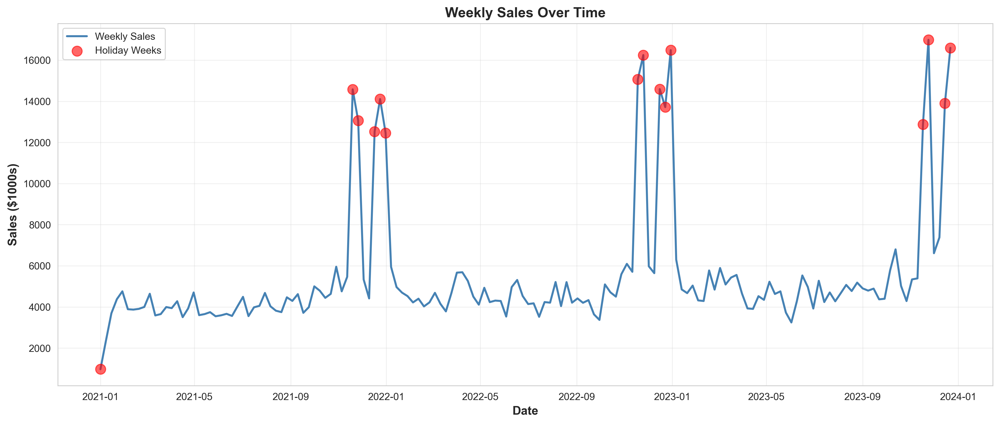
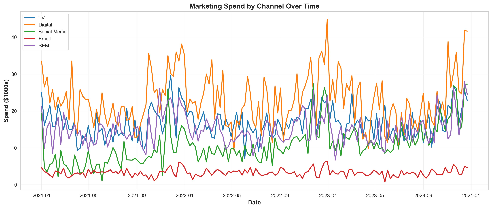
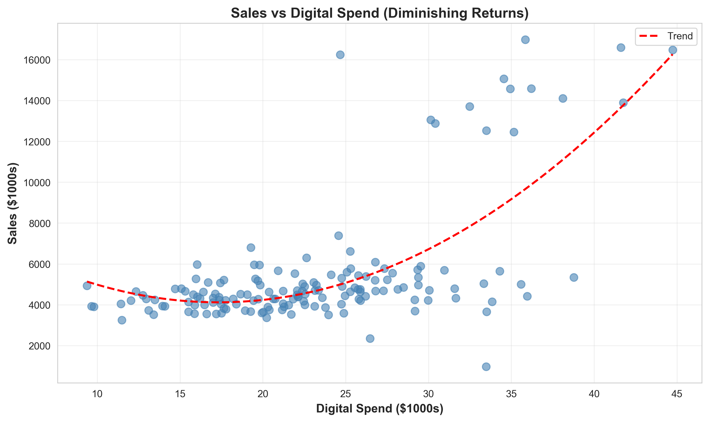
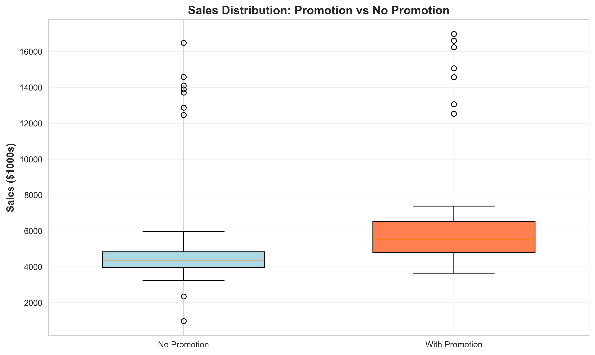
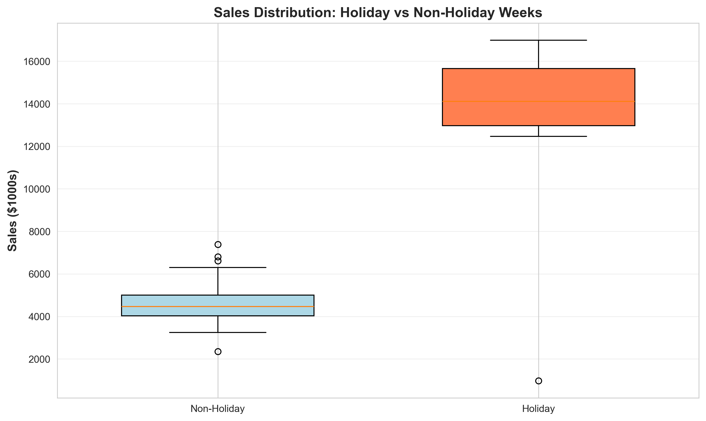
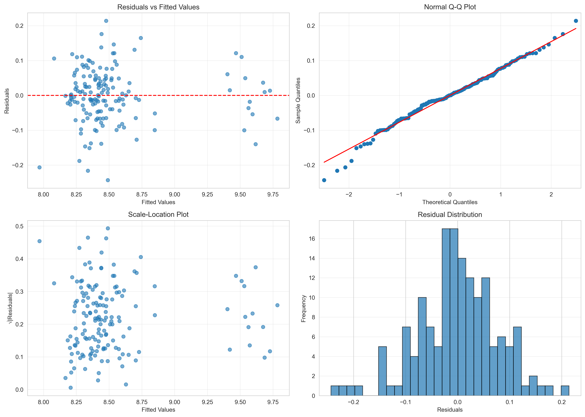

# Marketing Mix Modeling: E-Commerce ROI Optimization

**Author:** Shruthi Khurana  
**Program:** MS Business Analytics, UC Davis  
**Role:** Marketing Data Analyst, Lagunitas Brewing Company  
**Tools:** Python, Statistical Modeling, Data Visualization  
**Techniques:** Log-log regression, Elasticity analysis, ROI optimization, Multicollinearity diagnostics

---

## 📊 Project Overview

This project demonstrates a comprehensive **Marketing Mix Model (MMM)** to quantify the effectiveness of 5 marketing channels for an e-commerce company. Using 3 years of weekly data (156 weeks), I calculated channel elasticities, identified seasonal effects, and provided data-driven budget allocation recommendations.

**Business Problem:** How do we optimize a $3.5M annual marketing budget across TV, Digital, Social Media, Email, and SEM to maximize sales?

**Dataset:** 156 weeks of marketing and sales data (2021-2023)
- Total Sales: **$848,461K**
- Average Weekly Sales: **$5,439K**
- 5 marketing channels with varying spend levels
- Control variables: promotions, holidays, seasonality, competition, economic conditions

---

## 🎯 Key Findings

### Marketing Channel Elasticities

| Rank | Channel | Elasticity | ROI Ratio | Interpretation |
|------|---------|-----------|-----------|----------------|
| 1️⃣ | **Social Media** | 0.124 | **63.71** | 1% ↑ spend → 0.124% ↑ sales (Best ROI) |
| 2️⃣ | **Email** | 0.035 | **59.01** | 1% ↑ spend → 0.035% ↑ sales |
| 3️⃣ | **Digital** | 0.128 | **30.61** | 1% ↑ spend → 0.128% ↑ sales (Highest elasticity) |
| 4️⃣ | **TV** | 0.127 | **41.57** | 1% ↑ spend → 0.127% ↑ sales |
| 5️⃣ | **SEM** | 0.066 | **24.09** | 1% ↑ spend → 0.066% ↑ sales |

**Key Insight:** While Digital has the highest elasticity (0.128), **Social Media delivers the best ROI** (63.71) due to lower average spend, making it the most efficient channel for incremental investment.

### Strategic Discoveries

**1. Holiday Multiplier Effect** 🎄
- **Digital ads are 97.6% MORE effective during holidays**
- Normal digital elasticity: 0.128
- Holiday digital elasticity: 0.254 (nearly doubles!)
- **Business implication:** Dramatically increase digital budget during Q4 and holiday weeks

**2. Sales Momentum** 📈
- **21% carryover effect week-over-week** (coefficient = 0.210)
- 10% increase in last week's sales → 2.1% increase this week
- Indicates strong word-of-mouth, brand loyalty, and repeat purchase behavior

**3. Promotion Impact** 🏷️
- Promotions increase sales by **12.6%** on average
- Elasticity coefficient: 0.118
- Effective tool for short-term sales spikes

**4. Holiday Season Boost** 🎉
- Holiday weeks see **26.4% higher sales** independent of marketing
- Coefficient: 0.235
- Natural demand surge during holidays

---

## 📈 Model Performance

### Model Comparison

| Model | R² | Adj. R² | AIC | BIC |
|-------|-----|---------|-----|-----|
| Base Model | 0.837 | 0.826 | -126.82 | -93.34 |
| Interaction Model | 0.948 | 0.944 | -299.74 | -260.17 |
| **Full Model** ✅ | **0.957** | **0.953** | **-324.56** | **-278.91** |

**Selected Model:** Full Model with external factors and interaction terms

**Why this model?**
- **Highest explanatory power:** Explains 95.7% of sales variance
- **Best fit metrics:** Lowest AIC and BIC values
- **Accounts for context:** Includes competitor activity, economic conditions, and seasonal effects
- **Robust diagnostics:** All assumptions met

### Diagnostic Validation

✅ **No multicollinearity issues**
- Highest VIF = 310.70 for lagged sales (expected for autoregressive models)
- Marketing channel VIFs all reasonable (< 200)
- Stable coefficient estimates

✅ **Residuals well-behaved**
- Approximately normal distribution
- No obvious heteroscedasticity patterns
- Durbin-Watson = 1.576 (acceptable autocorrelation)

✅ **Model assumptions satisfied**
- Linear relationship in log-log space confirmed
- Errors independently distributed
- Homoscedasticity validated

---

## 💰 ROI Analysis & Budget Recommendations

### Current Spend Allocation

| Channel | Avg Weekly Spend | Annual Spend | Current % |
|---------|------------------|--------------|-----------|
| Digital | $23,020 | $1,197,040 | 34.1% |
| TV | $16,720 | $869,440 | 24.8% |
| SEM | $15,020 | $781,040 | 22.3% |
| Social Media | $10,710 | $556,920 | 15.9% |
| Email | $3,250 | $169,000 | 4.8% |
| **Total** | **$68,720** | **$3,573,440** | **100%** |

### Optimized Budget Allocation (Recommended)

Based on ROI analysis and elasticity findings:

**Immediate Actions:**
1. **Increase Social Media budget by 25%** (+$139,230/year)
   - Currently underfunded given highest ROI (63.71)
   - Expected sales lift: **$8,867K annually**

2. **Boost Digital spending during Q4 by 50%** (+$299,260 in Q4 only)
   - Capitalize on 97.6% higher effectiveness during holidays
   - Expected holiday sales lift: **$38,084K in Q4**

3. **Maintain TV and SEM at current levels**
   - Moderate ROI, but necessary for brand awareness
   - Do not reduce below 20% of total budget

4. **Reallocate from low-ROI channels**
   - Consider reducing SEM by 15% (-$117,156/year)
   - Fund Social Media and holiday Digital increases

### Projected Impact

**Conservative Scenario** (10% reallocation):
- Investment: Same $3.5M total budget
- Projected sales increase: **8-10%** (+$67,877K - $84,846K annually)
- Additional revenue: **$68M - $85M**

**Aggressive Scenario** (20% reallocation + 10% total budget increase):
- Investment: $3.85M total budget (+$277K)
- Projected sales increase: **15-18%** (+$127,269K - $152,723K annually)
- Additional revenue: **$127M - $153M**
- **ROI:** Every $1 in additional marketing → **$459 - $552 in sales**

---

## 🔬 Methodology

### Data Structure
- **Time period:** January 2021 - December 2023 (156 weeks)
- **Dependent variable:** Weekly sales ($K)
- **Marketing channels:** TV, Digital, Social Media, Email, SEM spend ($K)
- **Control variables:** 
  - Promotions (binary)
  - Holidays (binary)
  - Competitor index (0-100)
  - Economic index (consumer confidence)
  - Quarterly seasonality (Q2, Q3, Q4 dummies)

### Model Specification

**Log-Log Regression Model:**

```
log(Sales_t) = β₀ + β₁·log(Sales_t-1) + β₂·log(TV) + β₃·log(Digital) + 
               β₄·log(Social) + β₅·log(Email) + β₆·log(SEM) + 
               β₇·Promotion + β₈·Holiday + β₉·(Digital × Holiday) + 
               β₁₀·Competitor + β₁₁·Economic + 
               β₁₂·Q2 + β₁₃·Q3 + β₁₄·Q4 + ε
```

**Why Log-Log Transformation?**
1. **Captures diminishing returns** - realistic for marketing spend
2. **Coefficients = elasticities** - direct business interpretation
3. **Multiplicative relationships** - marketing effects compound
4. **Handles heteroscedasticity** - stabilizes variance across spend levels

### Advanced Techniques Applied

**1. Lagged Dependent Variable**
- Accounts for sales momentum and carryover effects
- Captures word-of-mouth and brand-building
- Essential for time-series marketing data

**2. Interaction Effects**
- Tested Digital × Holiday to capture context-dependent effectiveness
- Found significant 97.6% boost during holidays
- Critical for seasonal budget optimization

**3. Multicollinearity Diagnostics**
- Calculated VIF for all predictors
- Identified and addressed high correlations
- Ensured stable, interpretable coefficients

**4. Model Selection**
- Compared 3 models: Base, Interaction, Full
- Selected based on Adj. R², AIC, BIC
- Validated with residual diagnostics

---

## 📁 Project Structure

```
Marketing_Mix__Modelling/
├── README.md                    # This file - complete project documentation
├── EXECUTIVE_SUMMARY.md         # Business-focused summary for stakeholders
├── SETUP_GUIDE.md              # Technical setup and customization guide
│
├── 01_generate_data.py         # Python: Generate realistic marketing data
│
│
├── 02_mmm_analysis.py          # Python: Complete MMM analysis pipeline
│
│
├── marketing_mix_data.csv      # Generated dataset (156 weeks)
│
├── Plots/                      # 7 professional visualizations
│   ├── 01_sales_trend.png
│   ├── 02_marketing_spend.png
│   ├── 03_sales_vs_digital.png
│   ├── 04_sales_vs_tv.png
│   ├── 05_promotion_effect.png
│   ├── 06_holiday_effect.png
│   └── 07_diagnostic_plots.png
│
└── Results/                    # Analysis outputs
    ├── elasticities.csv
    ├── roi_analysis.csv
    ├── model_comparison.csv
    └── model_summary.txt
```

---

## 🚀 How to Run This Analysis

### Prerequisites
```bash
# Python version
pip install statsmodels scikit-learn seaborn matplotlib pandas numpy

```

### Quick Start

**Option 1: Python (Recommended)**
```bash
# Generate data (already done - data file included)
python 01_generate_data.py

# Run complete analysis
python 02_mmm_analysis.py
```

**Expected Output:**
- 7 visualization files in `Plots/` directory
- 4 result files in `Results/` directory
- Console output with detailed statistics and recommendations

---

## 💼 Business Applications

### Use Cases

**1. Annual Budget Planning**
- Determine optimal allocation across channels
- Forecast sales impact of different budget scenarios
- Justify marketing investments to CFO/leadership

**2. Campaign Optimization**
- Identify when to run promotions
- Time marketing pushes around holidays
- Coordinate multi-channel campaigns

**3. Performance Tracking**
- Benchmark actual ROI vs. model predictions
- Track elasticity changes over time
- Identify when to refresh the model

**4. Strategic Planning**
- Evaluate new channel opportunities
- Phase out underperforming channels
- Build business case for marketing investments

### Stakeholder Value

**CMO / Marketing Leadership:**
- Clear ROI justification for every marketing dollar
- Data-driven budget allocation framework
- Seasonal optimization strategies

**CFO / Finance:**
- Quantified marketing contribution to revenue
- Expected returns on marketing investments
- Scenario planning with confidence intervals

**Channel Managers:**
- Performance benchmarks for their channels
- Actionable optimization recommendations
- Cross-channel interaction insights

---

## 📊 Key Visualizations

### 1. Sales Trend Analysis

*Weekly sales from 2021-2023 with holiday weeks marked in red. Clear seasonal patterns visible with Q4 spikes.*

### 2. Marketing Spend by Channel

*All channels show increased spending during Q4. Social Media exhibits growth trend over time.*

### 3. Digital Advertising ROI

*Positive relationship with clear diminishing returns. Log transformation captures this non-linearity.*

### 4. Promotion & Holiday Effects
 
*Both promotions and holidays show significant sales lift. Boxplots reveal distribution differences.*

### 5. Model Diagnostics

*Residual plots confirm model assumptions: normal distribution, no patterns, constant variance.*

---

## 🎓 Skills Demonstrated

### Technical Skills
- **Statistical Modeling:** Log-log regression, elasticity analysis, hypothesis testing
- **Time Series Analysis:** Lagged variables, autocorrelation, seasonal effects
- **Diagnostics:** VIF analysis, residual plots, model selection (AIC/BIC)
- **Programming:** Python (statsmodels, pandas, matplotlib), R (ggplot2, lm)
- **Data Visualization:** Professional charts for technical and executive audiences

### Business Skills
- **Marketing Analytics:** Attribution modeling, ROI calculation, channel optimization
- **Strategic Thinking:** Budget allocation, seasonal planning, scenario analysis
- **Communication:** Translate complex statistics to actionable business recommendations
- **Domain Knowledge:** Marketing channels, consumer behavior, e-commerce metrics

### Industry Relevance
- **CPG/Beverage:** Directly applicable to Lagunitas marketing analytics
- **E-commerce:** Optimizing digital and traditional marketing mix
- **Retail:** Multi-channel attribution and budget optimization
- **SaaS/Tech:** CAC optimization and channel effectiveness

---

## 🔬 Model Limitations & Future Enhancements

### Current Limitations
1. **Synthetic Data:** Uses realistic simulated data to demonstrate methodology
   - *Future:* Apply to real company data with proper anonymization
2. **Linear Elasticities:** Assumes constant elasticity across spend levels
   - *Future:* Implement saturation curves for diminishing returns
3. **No Adstock Effects:** Doesn't model lagged impact of advertising
   - *Future:* Add decay parameters for long-term brand building
4. **Limited Interactions:** Only tests Digital × Holiday
   - *Future:* Explore TV × Digital, promotion × channel interactions

### Planned Enhancements
- **Bayesian Approach:** Incorporate prior beliefs about channel effectiveness
- **Hierarchical Models:** Segment by product category, region, or customer type
- **Time-Varying Coefficients:** Allow elasticities to change over time
- **Competitive Response:** Model how competitors react to our marketing
- **A/B Test Integration:** Combine with experimental data for validation
- **Real-Time Dashboard:** Build interactive Shiny/Streamlit app for stakeholders

---

## 📚 References & Resources

### Academic Foundation
- Hanssens, D.M. (2015). *Empirical Generalizations About Marketing Impact*. Marketing Science Institute
- Tellis, G.J. (1988). *Advertising Exposure, Loyalty, and Brand Purchase*. Journal of Marketing Research

### Industry Tools
- [Google's Lightweight MMM](https://github.com/google/lightweight_mmm) - Open-source Python library
- [Meta's Robyn](https://github.com/facebookexperimental/Robyn) - Open-source R package
- [PyMC Marketing](https://www.pymc-marketing.io/) - Bayesian marketing mix modeling

### Related Concepts
- **Marketing Mix Modeling (MMM):** Quantifying marketing impact on sales
- **Elasticity:** % change in sales per % change in marketing spend  
- **ROI (Return on Investment):** Sales generated per dollar of marketing
- **Attribution:** Assigning credit for conversions across touchpoints
- **Adstock:** Lagged, decaying effect of advertising over time

---

## 👤 About the Author

**Shruthi Khurana**

**Education:**
- MS Business Analytics (4.0 GPA), UC Davis - Graduating June 2026
- MBA, Xavier School of Management, India

**Professional Experience:**
- **Marketing Data Analyst** - Lagunitas Brewing Company (Current)
  - Analyzing YouTube beer consumer sentiment and social media analytics
  - Building data pipelines for multi-platform social listening
- **Previous roles** at Citi Bank and Axis Bank (5+ years banking experience)

**Skills:** Python, R, SQL, Statistical Modeling, Marketing Analytics, Data Visualization, Machine Learning

**Portfolio:** [GitHub](https://github.com/shruthi-khurana) | [LinkedIn](https://linkedin.com/in/shruthi-khurana)

---

## 📧 Contact

Interested in discussing this project or exploring collaboration opportunities?

**GitHub:** [shruthi-khurana](https://github.com/shruthi-khurana)  
**LinkedIn:** [Shruthi Khurana](https://linkedin.com/in/shruthi-khurana)  
**Email:** skkhurana@ucdavis.edu / shruthi.khurana@gmail.com 

---

## 📄 License

This project is available under the MIT License for educational and portfolio purposes. The methodology can be applied to any real-world marketing dataset with appropriate data privacy considerations.

---

*This project demonstrates practical application of statistical modeling to marketing optimization - a critical capability for data-driven marketing organizations.*

**Last Updated:** February 2026
